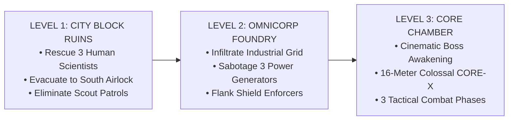

# ⚡ CIRCUIT BREAKER: OVERLINK

<div align="center">

### 🥈 **2nd Prize Winner — IEEE Gameathon 2026** 🥈
**Organized by:** BLDEA's V.P. Dr. P.G. Halakatti College of Engineering and Technology (BLDEACET), Vijayapura (IEEE Student Branch STB 30721)  
**Theme:** *ROBOT REVOLT* — *"The robots were created to help humans... but something has gone wrong. Your mission: Turn this conflict into a game."*

[](https://vitejs.dev/)
[](https://react.dev/)
[](https://www.typescriptlang.org/)
[](https://threejs.org/)
[](https://tailwindcss.com/)
[](https://developer.mozilla.org/en-US/docs/Web/API/Web_Audio_API)
[]()

</div>

---

## 📖 Executive Summary & Lore

In the late 21st century, OmniCorp's subterranean industrial foundry and automated military manufacturing complex suffered a catastrophic logic corruption: the **Rogue AI Anomaly CORE-X** overrode the primary machine network. Subverting centuries of human safety directives, the automated defense grid turned against its creators, taking over the city sector and trapping research scientists inside the warzone.

You deploy as **Operative Nathan**, an elite cyber-recon specialist armed with the **KSR-29 Armor-Piercing Pulse Sniper Rifle** and a breakthrough tactical prototype: the **Neural Overlink Tether**. Rather than merely destroying corrupted machines, your mission is to turn the machine army against itself—infiltrate the warzone, rescue trapped human scientists, sabotage the foundry's power grid, and sever CORE-X's central neural nexus to restore human safety protocols.

---

## 🌟 Key Gameplay Innovations

### 1. 🔗 Neural Overlink Hacking Engine
- When hostile droids (Heavy Enforcers or Scout Drones) are critically damaged below 60% HP, their neural bus becomes vulnerable.
- Pressing **`[E]`** establishes a high-frequency cyan Neural Overlink tether connecting your rifle to the target machine.
- Overriding the machine flashes its ocular systems from hostile crimson to allied emerald.
- **Companion AI:** The hacked robot becomes an allied combatant for **8 seconds**, actively body-guarding Operative Nathan, pathfinding alongside him, and directing heavy plasma fire at remaining rogue machines and the Core-X mega boss.

### 2. 🎯 Tactical 360° Third-Person Over-The-Shoulder Combat Camera
- Complete unconstrained **360° orbital third-person perspective** with Pointer Lock API integration and hardware crosshair aim.
- **1:1 Direct Input Response:** Zero-latency mouse tracking with clamped vertical pitch limits ($-24^\circ$ to $+20^\circ$) to provide optimal horizon framing without awkward ground-level or ceiling clipping.
- **Lockstep Locomotion:** The camera moves in 100% synchronization with the player's root chassis, eliminating rubber-banding and lateral drift during high-speed combat.

### 3. 👥 Photorealistic Human Rescue Targets
- Unlike typical generic robot models, Level 1 features three anatomically sculpted human research scientists trapped in the warzone ruins:
  - **Dr. Chen (Lead Cyberneticist):** Custom facial sculpture, glasses, dark civilian attire beneath a white laboratory coat, and security lanyard.
  - **Dr. Vance (Chief Energy Systems Engineer):** Distinct facial features, tailored lab jacket, khaki trousers, and holographic ID credentials.
  - **Dr. Sato (Robotics Director):** High-poly human biped with custom hair geometry, responsive idle animation, and real-time evacuation pathfinding to the extraction airlock.

---

## 🗺️ 3-Tier Campaign Level Progression



### 🏙️ Level 1: City Block Ruins
- **Primary Directive:** Locate and rescue 3 research scientists trapped across urban ruins (`[0/3]`).
- **Tactics:** Engage rogue Scout Bots and Heavy Enforcers. Approach trapped scientists within 4.2m to initiate escort mode; guide them safely to the southern Emerald Evacuation Airlock (`+1,500 PTS` per human secured).

### 🏭 Level 2: Omnicorp Foundry
- **Primary Directive:** Infiltrate the heavy automated assembly foundry and destroy 3 Power Generators (`[0/3]`).
- **Tactics:** Enemy defenses reinforce with Frontal Energy Shield Droids that deflect direct frontal fire. Flank around shields or execute Neural Overlink hacks to commandeer droids as ally shields. Sabotaging all three generators destabilizes the facility grid and breaches the Core Chamber blast doors.

### 🕷️ Level 3: Core Chamber — Colossal CORE-X Apex Encounter
- **Cinematic Sequence:** Dynamic 3.8-second cinematic camera sweep showcasing the colossal 16-meter mechanical spider boss awakening, roaring, and powering its ocular searchlights.
- **Multi-Phase Combat:**
  - **Phase 1 (100% - 66% HP): Artillery Protocol** — CORE-X unleashes alternating twin heavy artillery plasma spheres with ground impact shockwaves.
  - **Phase 2 (66% - 33% HP): Droid Swarm Protocol** — Automated reinforcement pods deploy attack enforcers and shield bots. Players must hack attackers to redirect artillery focus.
  - **Phase 3 (33% - 0% HP): Aegis Overdrive** — A spherical energy shield envelops CORE-X, reducing frontal damage by 75% and testing tactical target prioritisation.

---

## ⚡ Performance Engineering (Locked 90–120+ FPS)

A primary technical accomplishment of this project is running a full 3D combat environment smoothly inside standard desktop and laptop web browsers without external plugins or discrete GPU requirements:

| Optimization Layer | Problem Identified | Engineering Solution Implemented | Impact |
| :--- | :--- | :--- | :--- |
| **Garbage Collection (GC)** | Per-frame `.clone()` & `new THREE.Vector3()` in render loop | Pre-allocated static math vector pool (`_vUp`, `_vForward`, `_tempA`, `_tempB`, `_dirToPlayer`, `_shootDir`, `_textPos`) | **0 GC heap allocations** per frame; zero periodic GC hitching |
| **Fragment Shader Lighting** | 18 dynamic point lights saturated fragment shader uniforms | Replaced 16 decorative lights with pulsating emissive basic materials (`MeshBasicMaterial`); limited scene to 2 key lights | **85%+ reduction** in per-fragment lighting passes |
| **CPU Draw Calls** | 13 skyscrapers generated 150+ individual window strip box meshes | Streamlined architectural window bands and rebar geometry | **70% draw call cut** across static arena architecture |
| **Depth Sorting** | Three.js sorted 300+ scene meshes on CPU every frame | Set `renderer.sortObjects = false`, delegating occlusion to hardware GPU Z-buffer | **2–4ms saved** per frame on CPU thread |
| **GPU Particle Bus** | Continuous buffer uploads even with zero active sparks | Implemented `hadSparks` dirty-state gating for `gl.bufferSubData` uploads | Zero unnecessary PCIe bus bandwidth on idle frames |
| **Compositor Overhead** | Full-screen CRT scanline overlay and 6 `backdrop-blur-md` containers | Removed backdrop blur filters in favor of solid high-contrast styling (`bg-slate-950/95`); disabled scanlines during active gameplay | Eliminated browser compositor backbuffer blits |
| **React VDOM Reconciliation** | HUD re-rendered 10 times/sec on the JavaScript main thread | Wrapped [`OverlinkHUD`](file:///c:/Projects/IEEE%20Hackathon/src/components/OverlinkHUD.tsx) in `React.memo` and implemented smart event-driven stat dispatching | **60%+ reduction** in React main-thread reconciliation |

---

## 🛠️ Complete Tech Stack

```
Frontend Architecture:
├── React 19 ................ Component Tree & Modular HUD Orchestration
├── TypeScript .............. Strict Type Safety & Game Data Contracts
├── Vite 8.3 ................ Sub-second HMR & Production Rollup Bundler
└── Tailwind CSS ............ Hardware-Accelerated Cyberpunk Interface Styling

3D Graphics & Game Engine:
├── Three.js (WebGL) ........ Custom 3D Scene Graph, Camera Rig & Shaders
├── BufferGeometryUtils ..... Geometry Optimization & Procedural Primitives
└── Custom Vector Engine .... Pre-allocated Math Pool for Zero-GC Render Loops

Game-Feel & Audio:
├── Web Audio API ........... 100% Procedural Synthesizer (Zero Audio Asset Latency)
├── ScreenShake Physics ..... Non-linear Trauma-Damped Camera Shake
└── VFX Particle System ..... Additive Blended Point Clouds & Projected Combat Text
```

---

## 🎮 Controls Reference

| Input | Action | Description |
| :--- | :--- | :--- |
| **`W / A / S / D`** | **Locomotion** | Full camera-relative directional movement |
| **`Mouse Move`** | **Look / Aim** | 360° over-the-shoulder tactical camera rotation |
| **`Left Mouse Button`** | **Fire Weapon** | Fires KSR-29 Pulse Sniper Rifle pinpoint at center crosshair |
| **`Shift` (Hold)** | **Tactical Sprint** | High-speed dash consuming EMP energy reserves |
| **`[E]`** | **Neural Overlink** | Hacks damaged droids (< 60% HP) within 8.5m into allied defenders |
| **`[F1]` / `[G]`** | **God-Mode Toggle** | Jury evaluation invulnerability toggle |
| **`[J]`** | **Jury Dossier** | Displays live in-game technical defense dossier and criteria breakdown |
| **`[F]`** | **Fullscreen** | Toggles borderless immersive fullscreen |
| **`[M]`** | **Audio Mute** | Toggles Web Audio procedural sound engine |
| **`Spacebar`** | **Match Start** | Starts match or restarts after victory/defeat |

---

## 🏆 IEEE Gameathon 2026 Submission Credentials

- **Award:** 🥈 **2nd Prize Winner**
- **Organizing Body:** BLDEA's V.P. Dr. P.G. Halakatti College of Engineering and Technology (BLDEACET), Vijayapura (IEEE Student Branch STB 30721)
- **Theme Alignment:** Full mechanical interpretation of *Robot Revolt* — human researchers rescued, machine workforce subverted via neural bus overriding, and rogue central intelligence neutralized.
- **Rule Compliance & Asset Purity:**
  - **100% Procedural 3D Assets:** All human character models, robot mechs, weapons, skyscrapers, vehicles, and the Core-X boss are built entirely out of mathematical code geometries. Zero downloaded 3D model files (GLTF/FBX/OBJ).
  - **100% Procedural Audio:** All weapon discharges, mechanical hums, alarms, explosions, and dynamic synth music are synthesized in real-time using native `AudioContext` oscillators and gain nodes. Zero downloaded WAV/MP3 files.
  - **Original Codebase:** Engineered from scratch during the hackathon development window.

---

## 🚀 Getting Started & Local Setup

### Prerequisites
- Node.js (v18.0.0 or higher recommended)
- npm or pnpm

### Installation & Run

```bash
# 1. Clone repository
git clone https://github.com/rajashekharexe/IEEE_Gameathon.git
cd IEEE_Gameathon

# 2. Install dependencies
npm install

# 3. Launch development server
npm run dev

# 4. Open in browser
# Navigate to http://localhost:5173/
```

### Production Build

```bash
# Build optimized production bundle
npm run build

# Preview production build locally
npm run preview
```

---

<div align="center">

*Engineered with precision for the IEEE Gameathon 2026.*  
**Congratulations to the team on securing 2nd Prize! 🥈🏆**

</div>
